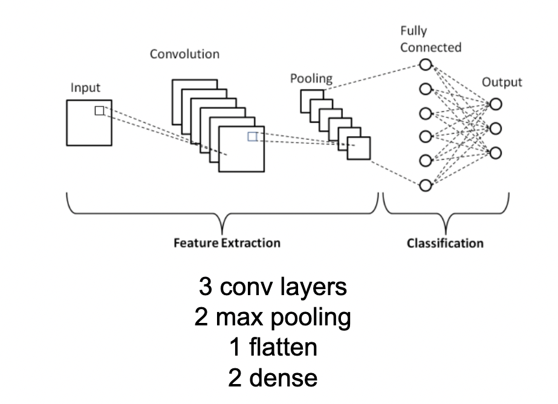

# OCR with Neural Network
The aim of the project is to demonstrate an application with OCR capabilities. Main application components are a photo processing pipeline, built on OpenCV and a convolutional neural network, built on Tensorflow.

# Contents
1. Task definition
2. Photo processing pipeline
3. Training data gathering process
4. Neural Network
6. Data augmentation
7. Results and limitations
7. Future work and improvements
8. References


## Task definition
The goal of the project is to implement a practical computer vision application, which is able to process photos of text and recognize the characters. 


## Photo processing pipeline
In order to achieve that, a robust photo processing pipeline is needed. The pipeline itself needs to be relatively robust towards:
- Different lighting conditions - some photos can be taken at daylight, others - with artificial light.
- Different focus conditions - some parts of the photo may be "crisp", others - not so much.
- "Noise" present on the paper photographed - spots, dots, crumples or other simple artifacts should not prevent the pipeline from properly analysing the image.
- Multiple words - pipeline should be able to distinguish where a word ends and another begins.
- Multiple lines - pipeline should be able to handle multiple lines and multiple words within each line. Line and word order should be preserved after being analysed.
- Different sizes of text on every line - each line might have different font size (e.g. title, subtitle, text).

In a real-world production-grade OCR system, additional requirements are also present: angle handling, filtering of additional items present on the sheet of paper, (e.g. pen), and many many others.   
These will not be a focus of the current version of the project, but might be improved upon in the future.  

  


The pipeline has 9 distinct stages:
1. Read image and convert to grayscale
2. Apply [Laplacian differential operator](https://en.wikipedia.org/wiki/Laplace_operator) on image in order to detect edges (edges are very detectable in pen handwriting)
3. Since outputs of the laplacian filter performed on images of a white sheet of paper are predictable and robust, they are sutiable as input to a binarizing algorithm. Several different adaptive binarizers were attempted during project development (including [Otsu's](https://en.wikipedia.org/wiki/Otsu%27s_method) binarization method, custom adaptive-binarization, etc). Results tended to be unstable - a perfectly normal image would have parts of it improperly binarized because of simple light and shade shifts. Using binarization after performing laplacian filter proved a lot more robust to different lightings and focus conditions.
4. After binarization, due to pen handwriting not being perfectly continuous, small "gaps" in letter definitions appear - this is because the edge detection algorithm does not highlight edges where handwriting is "bleak" (pen ink is more transparent). To deal with that, adaptive thickening algorithm was implemented. On the binarized image, bounded dilatation is applied - between 1 and 3 iterations. Number of found connected components is counted. The correct number of dilatation iterations is the one that minimizes the number of found components, and is between 1 and 3. The reasoning behind the algorithm is as follows - at least 1 dilatation needs to be performed because of gaps in the edges found by the laplacian. If by performing dilatations, number of found components decrease, that means dilatation is "connecting" components. A certain amount of "connections" is beneficial, since of expected gaps. However this needs to be bounded, as it can connect two characters together. Heuristically 1 to 3 px of dilatation has proved to be effective.
Example 1 of steps 1-4:

Example 2:

5. After proper amount of "thickening" has been chosen, the next step is to locate the connected components (letters). OpenCV's [connectedComponents](https://docs.opencv.org/3.4/d3/dc0/group__imgproc__shape.html) proved an excellent fit for job, able to return boundaries, areas and exact pixels belonging to each connected component (letter).
6. The area for each component returned is especially important, since we are able to perform noise suppression checks based on it. While in real-world application noise suppression parameters might need to be adaptive based on the photo, a simple pixel based constant proved to work good on all test samples.

7. Bounding boxes of components are extracted, cropped and saved in memory. These are the letters that will be analysed. Their positions on the photo will be used to form lines and words.
8. Lines forming. A recursive "elimination" algorithm is performed - letter bounding boxes are sorted by their y component in ascneding order, and the one closest to the top of the image is chosen. A virtual horizontal line is then created through the center of it - every letter that this line crosses is considered part of the same row. All letters on the same row (including the source one) are removed from the set and procedure is repeated until no letter is left. While being simple and fast to implement, the algorithm has a drawback that if curved handwriting is used, it won't be detected as a single row. In future works, arcs instead of lines can be used to trace curved handwriting.
 
9. Words forming. A simple statistics-based algorithm is performed here - for each line, analyse the spaces between the letters. If there is enough variation (maximum is bigger than 2 times the mean), multiple words exist and spacing must be detected. A reduced maximum (*0.95) is used as threshold (to take into account off-by-1 pixel-based errors on word spacing columns). Distributions of spaces with very little variance points out that this is due to letter spacings between a word - just a single word is present in that case. Each line must be processed separately - in a line with bigger font (e.g. title), distribution of spaces will be different from other (regular) lines. 
 

## Training data gathering process
A selection of system-available fonts was chosen - half of them machine fonts, other half 'handwritten-like'.  
Fonts needed to be selected carefully, as unreliable fonts do exist - they can have very unexpected drawings of characters that provide very little visual resemblence to the character they are supposed to represent.
```commandline
# Selection of fonts - part of them are handwritten, others are machine fonts
handwritten_fonts = ['Herculanum', 'Annai MN', 'Bradley Hand', 'Brush Script MT', 'Chalkboard',
             'Comic Sans MS', 'Luminary', 'Noteworthy', 'Papyrus', 'Party LET', 'Savoye LET', 
             'Sign Painter', 'Skia', 'Snell Roundhand', 'Times New Roman', 'Trattatello']
typed_fonts = ['Arial', 'Arial Black', 'Arial Narrow', 'Arial Rounded MT Bold', 'Copperplate', 'Courier New', 'Helvetica',
              'Impact', 'Lucinda Grande', 'Microsoft Sans Serif', 'Tahoma', 'Verdana', 'Menlo', 'Didot', 'Copperplate', 'Avenir', 'Futura']

fonts = handwritten_fonts + typed_fonts 
```

After that, for each font and for each character class (33 selected fonts, 26 character classes for english), the letter was drawn on an offscreen canvas using the specified font and saved to disk to form the initial dataset.
This is how the data for class (character) "A" looks like:
 

A random sample of the data generated for the neural network is demonstrated below. Take a note of the very different styles of letters present in the system-available fonts:
 

## Convolutional Neural Network
 

A very small convolutional neural network was used - a total of 8 layers - 3 convolutional, 2 max pooling, 1 flatten and 2 dense layers.
The network is purposefuly chosen to be small. Character bounding boxes were expected to be small and the distinction of letters is a relatively simple visual task. Not a lot of capacity was required from the network. 
Tensorflow was chosen as implementation framework.   
While papers do exist for similar visual tasks citing use of [AlexNet](https://reader.elsevier.com/reader/sd/pii/S1877050920307596?token=F659249A62DBCF7858DD0A8FAFDF9E890B44D264A3B5A87EB985E2D3F159511626580113016B1464AEFD392E78950FF8&originRegion=eu-west-1&originCreation=20230109190807), LeNet, etc, that would entail significantly more training and testing data and better hardware to train on.

## Data augmentation
The initial train set consisted of 33*26 = 858 images. The neural network was trained on it and was able to produce 85% accuracy on the test set.
Additional data augmentation was performed to improve performance.   
Since in handwriting slight incline is common, rotations on -15, -10, -5, 5, 10, 15 degrees were performed for each image.  
Additionally, erosion and dilatation (single iteration) were performed on the images (this gave the nice benefit of recognizing text written with marker instead of pen).
For each image in the dataset, additional 18 versions were added (6 rotations x {Dilatation, No Change, Erosion}).
The resulting dataset consisted of 15444 images.

Random sample of the augmented data:
 

## Results and limitations
 

The test set consisted of 16 images of paper sheets with text - total of 162 characters.  
Most of them were written with pen, a few of them - with marker.  
The network achieved peak accuracy of 97% after training for 15 epochs on extended train set (with augmentation).  
While additional validation set must be used to fine-tune the network, due do time pressures only test set was used. Because of that, no other fine-tuning methods were attempted - no tuning of learning rates, batch sizes and even model architecture was performed.
A more broad and diverse test set needs to be gathered, needs to be split into validation and test, fine-tuning should be performed and then more making definitive statements about accuracy can be made.
Trained model is available as 'model_best_100_60.h5'.

## Future work and improvements
Several improvements can be implemented in near future:
- More diverse test set can be collected - containing handwriting of multiple people, phographed from different angles, with different cameras/phones, etc.
- Additional existing datasets can be used - e.g. [EMNIST](https://www.nist.gov/itl/products-and-services/emnist-dataset)
- That would allow for usage of a bigger network with more capacity (e.g. AlexNet, small resnets, etc)
- Pipeline can be improved significantly - smarter binarization method can be found (or learned - e.g. a binarization CNN can be trained to extract the text from a photo). This would exclude the need for using edge detection filters and would improve pipeline stability and robustness.
- After higher levels of accuracy are achieved, dictionary-based correction module can be applied - correcting simple errors of the OCR program.

## References
1. https://en.wikipedia.org/wiki/Laplace_operator
2. https://en.wikipedia.org/wiki/Otsu%27s_method
3. https://docs.opencv.org/3.4/d3/dc0/group__imgproc__shape.html
3. https://reader.elsevier.com/reader/sd/pii/S1877050920307596?token=F659249A62DBCF7858DD0A8FAFDF9E890B44D264A3B5A87EB985E2D3F159511626580113016B1464AEFD392E78950FF8&originRegion=eu-west-1&originCreation=20230109190807
4. https://www.nist.gov/itl/products-and-services/emnist-dataset

